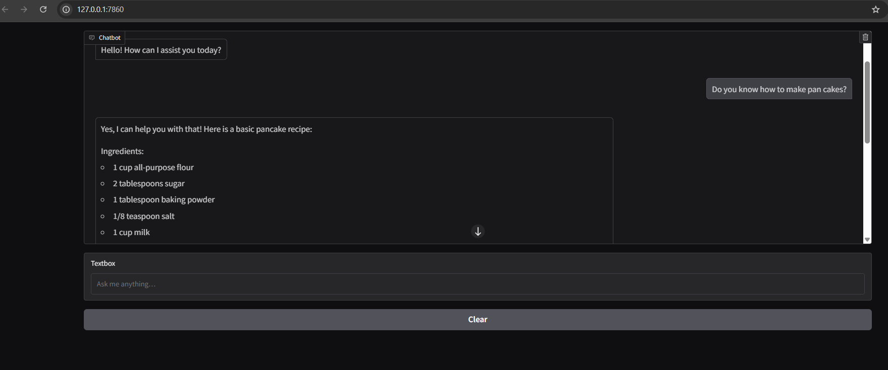

# Chatbot using LangChain

A modern, context-aware AI assistant built with [OpenAI](https://openai.com/), [LangChain](https://www.langchain.com/), and a Gradio frontend.  
Now supports **Retrieval-Augmented Generation (RAG)** for document-grounded answers.

---

## 🖼️ UI Preview

---

## 🚀 Features

- Conversational memory via LangChain  
- Document-aware answers through RAG (FAISS vector store)  
- Fast Gradio interface  
- Simple `.env` for API-key management  

---

## 📦 Requirements

- Python 3.8 or higher  
- An OpenAI API key  

---

## 📁 Project Structure

    langchain_chatbot/
    ├── main.py            # Gradio interface
    ├── chatbot.py         # Conversation logic & memory
    ├── config.py          # Model & prompt config
    ├── retriever.py       # FAISS retrieval helper
    ├── ingest.py          # Script to embed & index docs
    ├── docs/              # Put your .txt files here
    ├── faiss_index/       # Auto-generated vector store
    └── .env               # API key

---

## 🛠️ Setup

1. Install dependencies:

        pip install -r requirements.txt

2. Add your OpenAI key in a `.env` file:

        OPENAI_API_KEY=your-openai-key

3. Place source documents (`.txt`, `.md`, etc.) in the `docs/` folder.

4. Build the FAISS index:

        python ingest.py

---

## 💬 Running the Chatbot

    python main.py

Open the URL printed in your terminal (usually `http://127.0.0.1:7860`).

---

## 🧠 How It Works

1. The user question is embedded and matched to top-k docs via FAISS.  
2. Retrieved snippets are injected into the prompt.  
3. The prompt + chat history is sent to OpenAI.  
4. The grounded response is streamed back to the Gradio UI.

---

## 🛡️ Notes

- FAISS uses pickle files; only load indexes you trust.  
- After indexing, all retrieval happens locally—no repeated embedding cost.  

---

## 📌 Roadmap

- [ ] PDF / HTML ingestion  
- [ ] Streaming token responses  
- [ ] Source citations with metadata  
- [ ] Redis-backed long-term memory  

---

## 📖 License

MIT — hack, learn, extend!
